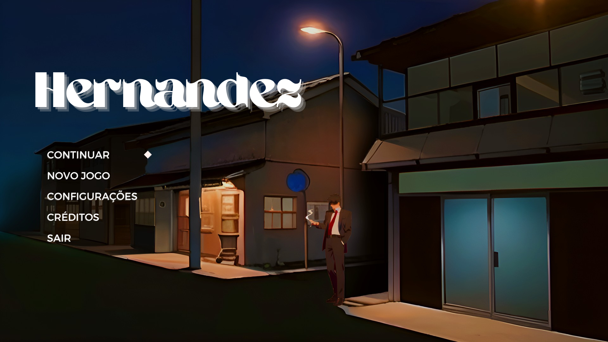

# 2023-303-Hernandez
<!-- # 2022-303-NomeASerDefinido -->

<h1 align="center">🤓 Menu 🤓</h1>

 Equipe: Gabi, Iza, Smolinski, Léo, Thales, Eduardo 

# Menu Principal

## Tela inicial:
A imagem abaixo mostra nosso 'Menu Principal', com 5 botões clicáveis:
- Continuar -> Carrega o save;
- Novo Jogo -> Cria um novo save;
- Ajustes -> Mais detalhes abaixo;
- Criadores -> Os créditos do jogo com nossos nomes;
- Sair -> Fecha o jogo;

	
## Ajustes
- Pular Puzzles -> Opção feita para pessoas que querem aproveitar a história;
- Reajustar Controles -> Permite remapear as teclas;
- Volume -> Ajuste de Volume;
- Tamanho da Fonte -> Para facilitar a leitura;
- Filtros de Daltonismo diferentes;
	

## Créditos:
- Os nomes dos integrantes do grupo;

## Sprites
-> Drive com os sprites: https://drive.google.com/drive/folders/1_L_OlOB_ZHcBxXEfGciqQ4gHU6Divk-U?usp=sharing
