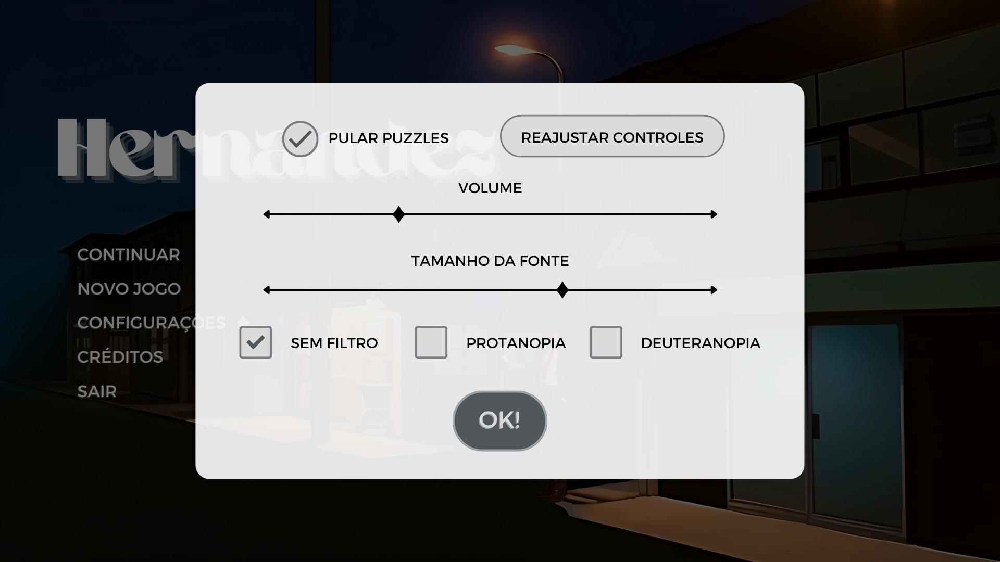
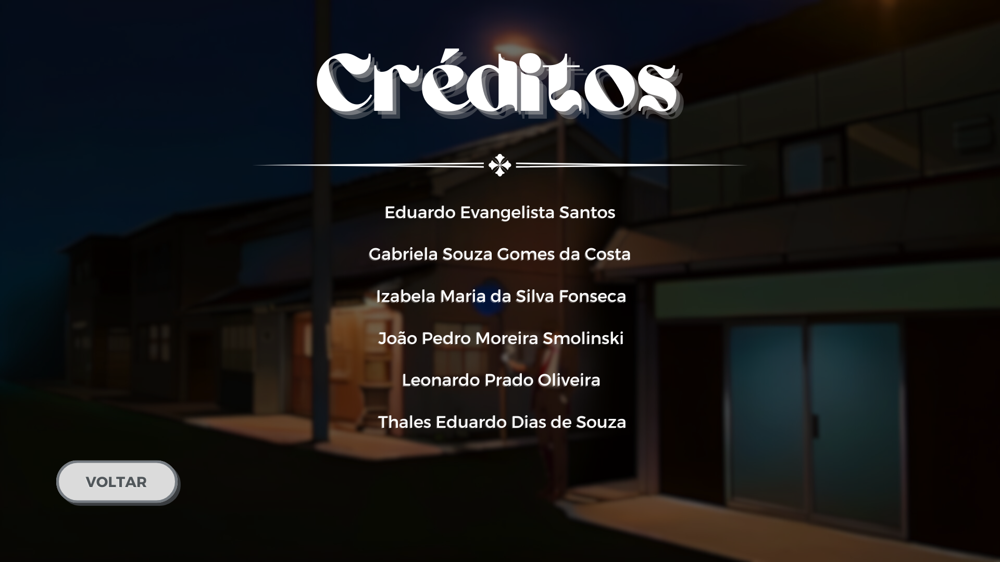
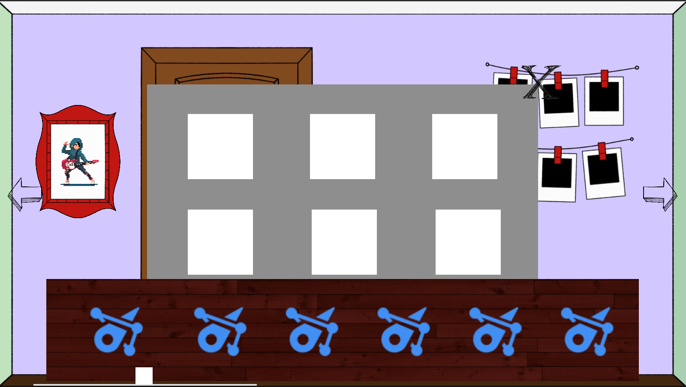
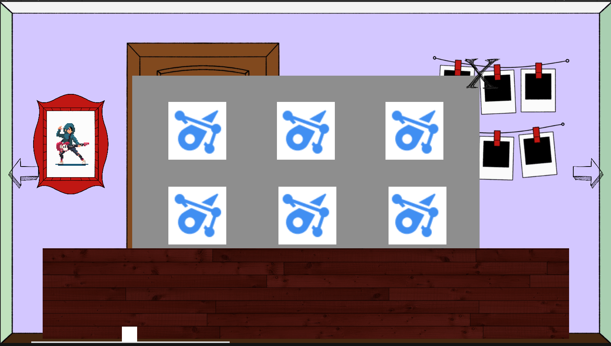
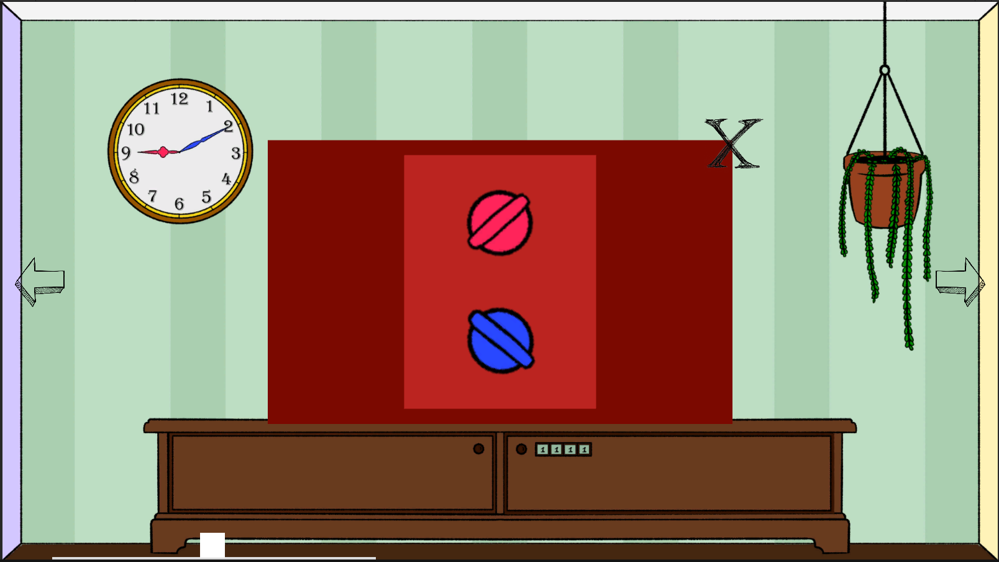
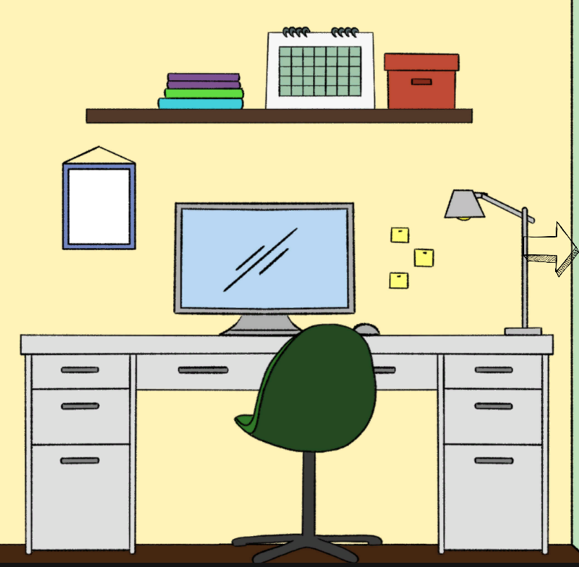
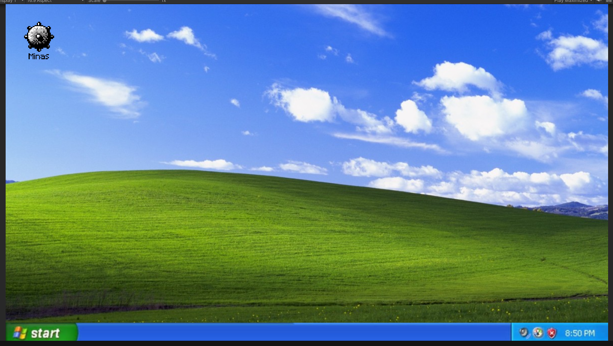
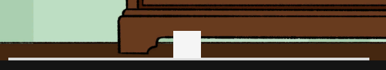

# 2023-303-Hernandez
<!-- # 2022-303-NomeASerDefinido -->

<h1 align="center">🤓 Menu 🤓</h1>

 Equipe: Gabi, Iza, Smolinski, Leo, Thales, Eduardo 

# Menu Principal 

## Tela inicial:
A imagem abaixo mostra nosso 'Menu Principal', com 5 botões clicáveis:
- Continuar -> Carrega o save;
- Novo Jogo -> Cria um novo save;
- Ajustes -> Mais detalhes abaixo;
- Criadores -> Os créditos do jogo com nossos nomes;
- Sair -> Fecha o jogo;

	
## Ajustes
- Pular Puzzles -> Opção feita para pessoas que querem aproveitar a história;
- Reajustar Controles -> Permite remapear as teclas;
- Volume -> Ajuste de Volume;
- Tamanho da Fonte -> Para facilitar a leitura;
- Filtros de Daltonismo diferentes;
	

## Créditos:
- Os nomes dos integrantes do grupo;

## Sprites
-> Drive com os sprites: https://drive.google.com/drive/folders/1_L_OlOB_ZHcBxXEfGciqQ4gHU6Divk-U?usp=sharing

## Puzzles
### Enigma das Fotos
Para resolver esse puzzle, é necessário coletar informações ao redor do quarto. Quando a ordem correta é colocada, um novo evento acontece.

### Controles da TV
Assim como o puzzle acima, é necessário uma atenção aos detalhes do quarto para revelar um vídeo secreto da TV. 

### Computador
Há também um computador, que exige uma senha para acessá-lo.

	
O campo minado é um puzzle secundário que pode (ou não) revelar uma conquista.

### Inventário
Com o andamento da história, itens colecionáveis podem ser achados para permitir a realização de algum outro puzzle.

### Jogo dos 8
Puzzle com um Easter Egg da ideia original do jogo.

### Senha do Armário
Para conseguir abrir esse armário, é preciso uma senha secreta encontrada em un lugar secreto.

